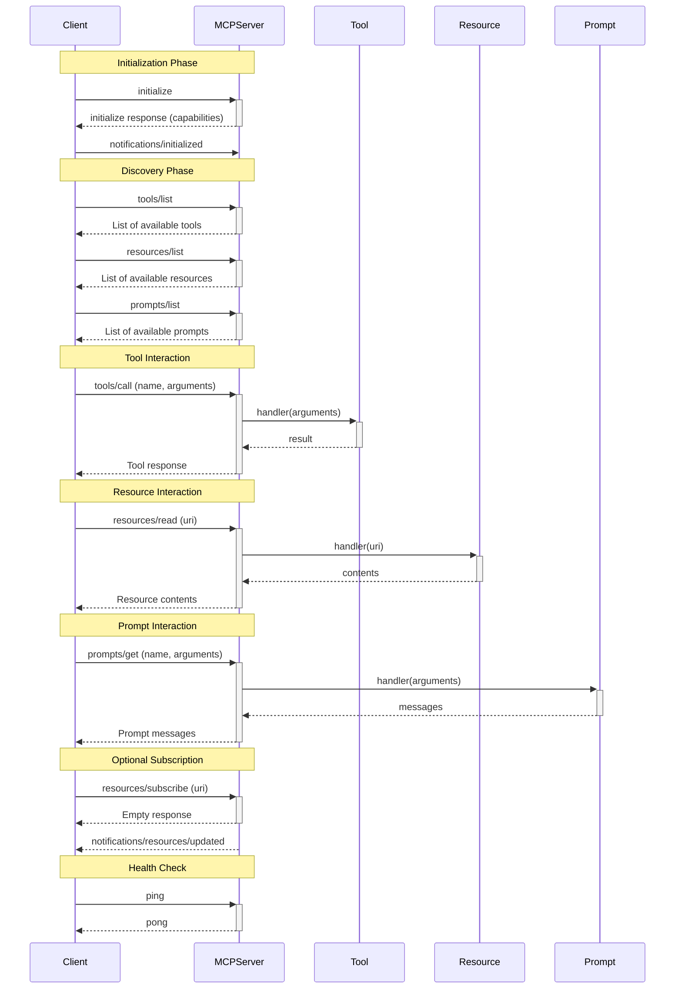

# io.modelcontext/clojure-sdk

A `clojure-sdk` for creating Model Context Protocol servers!

## Table of Contents          :TOC_4:
- [io.modelcontext/clojure-sdk](#iomodelcontextclojure-sdk)
  - [Usage](#usage)
    - [Deps](#deps)
    - [Templates for Quickstart](#templates-for-quickstart)
    - [Examples](#examples)
      - [Building the Examples Jar](#building-the-examples-jar)
      - [Calculator: `calculator_server`](#calculator-calculator_server)
      - [Vega-lite: `vegalite_server`](#vega-lite-vegalite_server)
      - [Code Analysis: `code_analysis_server`](#code-analysis-code_analysis_server)
  - [Core Components](#core-components)
  - [Communication Flow](#communication-flow)
  - [Pending Work](#pending-work)
  - [Development of the SDK](#development-of-the-sdk)
  - [Inspiration](#inspiration)
  - [License](#license)

## Usage

The [calculator_server.clj file](examples/src/calculator_server.clj)
and [vegalite_server.clj file](examples/src/vegalite_server.clj)
examples contains a full working code for defining an MCP server.

`examples` is a `deps-new` app project, and instructions for compiling
and running the various example servers are in [the examples/README.md
file](examples/README.md) (also copied below this section)

### Deps
The deps for `clojure-sdk` are:

```clojure
{io.modelcontextprotocol/mcp-clojure-sdk
 {:git/url "https://github.com/unravel-team/mcp-clojure-sdk.git"
  :git/sha "d42474c5f66b6f5ad1e4d6ce2a4e8972640fb831"}}
```

### Templates for Quickstart
For your ease of use, there is also a `deps-new` template and a Github template. See:
1. [mcp-clojure-server-deps-new](https://github.com/unravel-team/mcp-clojure-server-deps-new)
   for a `deps-new` based template to quickly create new MCP servers.
2. [example-cool-mcp-server](https://github.com/unravel-team/example-cool-mcp-server)
   for a Github template project to quickly create new MCP servers.

### Examples

#### Building the Examples Jar

    $ make clean && make examples-jar

The examples jar contains the following servers:
1. Calculator: `calculator_server`
2. Vega-lite: `vegalite_server`
3. Code Analysis: `code_analysis_server`

#### Calculator: `calculator_server`
Provides basic arithmetic tools: `add`, `subtract`, `multiply`,
`divide`, `power`, `square-root`, `average`, `factorial`

Some example commands you can try in Claude Desktop or Inspector:

1. What's the average of [1, 2, 3, 4, 5]?
2. What's the factorial of 15?
3. What's 2 to the power of 1000?
4. What's the square-root of 64?

##### Before running the calculator MCP server:
Remember:
1. Use the full-path to the examples JAR on your system

##### In Claude Desktop

```json
    "calculator": {
      "command": "java",
      "args": [
        "-Dclojure.tools.logging.factory=clojure.tools.logging.impl/log4j2-factory",
        "-Dorg.eclipse.jetty.util.log.class=org.eclipse.jetty.util.log.Slf4jLog",
        "-Dlog4j2.contextSelector=org.apache.logging.log4j.core.async.AsyncLoggerContextSelector",
        "-Dlog4j2.configurationFile=log4j2-mcp.xml",
        "-Dbabashka.json.provider=metosin/jsonista",
        "-Dlogging.level=INFO",
        "-cp",
        "/Users/vedang/mcp-clojure-sdk/examples/target/io.modelcontextprotocol.clojure-sdk/examples-1.2.0.jar",
        "calculator_server"
      ]
    }
```

##### In MCP Inspector

```shell
npx @modelcontextprotocol/inspector java -Dclojure.tools.logging.factory=clojure.tools.logging.impl/log4j2-factory -Dorg.eclipse.jetty.util.log.class=org.eclipse.jetty.util.log.Slf4jLog -Dlog4j2.contextSelector=org.apache.logging.log4j.core.async.AsyncLoggerContextSelector -Dlog4j2.configurationFile=log4j2-mcp.xml -Dbabashka.json.provider=metosin/jsonista -Dlogging.level=INFO -cp examples/target/io.modelcontextprotocol.clojure-sdk/examples-1.2.0.jar calculator_server
```

#### Vega-lite: `vegalite_server`
Provides tools for generating Vega-lite charts: `save-data`,
`visualize-data`.

PRE-REQUISITES: Needs [vl-convert
CLI](https://github.com/vega/vl-convert) to be installed.

Some example commands you can try in Claude Desktop or Inspector:

Here is some example data for you:
```json
[
    { "year": 2011, "value": 14.6, "growth_type": "Market Cap Growth" },
    { "year": 2011, "value": 11.4, "growth_type": "Revenue Growth" },
    { "year": 2011, "value": 26.6, "growth_type": "Net Income Growth" },
    { "year": 2012, "value": 40.1, "growth_type": "Market Cap Growth" },
    { "year": 2012, "value": 42.7, "growth_type": "Revenue Growth" },
    { "year": 2012, "value": 36.9, "growth_type": "Net Income Growth" },
    { "year": 2013, "value": 16.9, "growth_type": "Market Cap Growth" },
    { "year": 2013, "value": 14.6, "growth_type": "Revenue Growth" },
    { "year": 2013, "value": 15.3, "growth_type": "Net Income Growth" },
    { "year": 2014, "value": 9.6, "growth_type": "Market Cap Growth" },
    { "year": 2014, "value": 7.9, "growth_type": "Revenue Growth" },
    { "year": 2014, "value": 10.9, "growth_type": "Net Income Growth" },
    { "year": 2015, "value": 5.8, "growth_type": "Market Cap Growth" },
    { "year": 2015, "value": 6.7, "growth_type": "Revenue Growth" },
    { "year": 2015, "value": 6.2, "growth_type": "Net Income Growth" },
    { "year": 2016, "value": -12.4, "growth_type": "Market Cap Growth" },
    { "year": 2016, "value": -3.9, "growth_type": "Revenue Growth" },
    { "year": 2016, "value": -32.2, "growth_type": "Net Income Growth" },
    { "year": 2017, "value": 25.3, "growth_type": "Market Cap Growth" },
    { "year": 2017, "value": 5.9, "growth_type": "Revenue Growth" },
    { "year": 2017, "value": 43.9, "growth_type": "Net Income Growth" }
]
```
Visualize this data for me using vega-lite.

##### Before running the vegalite MCP server
Remember:
1. Replace the full-path to the examples JAR with the correct path on
   your system
2. Specify the full-path to `vl-convert` on your system

##### In Claude Desktop

```json
    "vegalite": {
      "command": "java",
      "args": [
        "-Dclojure.tools.logging.factory=clojure.tools.logging.impl/log4j2-factory",
        "-Dorg.eclipse.jetty.util.log.class=org.eclipse.jetty.util.log.Slf4jLog",
        "-Dlog4j2.contextSelector=org.apache.logging.log4j.core.async.AsyncLoggerContextSelector",
        "-Dlog4j2.configurationFile=log4j2-mcp.xml",
        "-Dbabashka.json.provider=metosin/jsonista",
        "-Dlogging.level=INFO",
        "-Dmcp.vegalite.vl_convert_executable=/Users/vedang/.cargo/bin/vl-convert",
        "-cp",
        "/Users/vedang/mcp-clojure-sdk/examples/target/io.modelcontextprotocol.clojure-sdk/examples-1.2.0.jar",
        "vegalite_server"
      ]
    }
```

##### In MCP Inspector
Remember to use the full-path to the examples JAR on your system, or
execute this command from the `mcp-clojure-sdk` repo.

```shell
npx @modelcontextprotocol/inspector java -Dclojure.tools.logging.factory=clojure.tools.logging.impl/log4j2-factory -Dorg.eclipse.jetty.util.log.class=org.eclipse.jetty.util.log.Slf4jLog -Dlog4j2.contextSelector=org.apache.logging.log4j.core.async.AsyncLoggerContextSelector -Dlog4j2.configurationFile=log4j2-mcp.xml -Dbabashka.json.provider=metosin/jsonista -Dlogging.level=INFO -Dmcp.vegalite.vl_convert_executable=/Users/vedang/.cargo/bin/vl-convert -cp examples/target/io.modelcontextprotocol.clojure-sdk/examples-1.2.0.jar vegalite_server
```

#### Code Analysis: `code_analysis_server`
This server is an example of a server which provides prompts and not
tools. The following prompts are available: `analyse-code` and
`poem-about-code`.

You can try the prompts out in Claude Desktop or Inspector. While
these prompts are very basic, this is a good way to see how you could
expose powerful prompts through this technique.

##### Before running the code-analysis MCP server
Remember:
1. Replace the full-path to the examples JAR with the correct path on
   your system

##### In Claude Desktop

```json
    "code-anaylsis": {
      "command": "java",
      "args": [
        "-Dclojure.tools.logging.factory=clojure.tools.logging.impl/log4j2-factory",
        "-Dorg.eclipse.jetty.util.log.class=org.eclipse.jetty.util.log.Slf4jLog",
        "-Dlog4j2.contextSelector=org.apache.logging.log4j.core.async.AsyncLoggerContextSelector",
        "-Dlog4j2.configurationFile=log4j2-mcp.xml",
        "-Dbabashka.json.provider=metosin/jsonista",
        "-Dlogging.level=INFO",
        "-cp",
        "/Users/vedang/mcp-clojure-sdk/examples/target/io.modelcontextprotocol.clojure-sdk/examples-1.2.0.jar",
        "code_analysis_server"
      ]
    }
```

##### In MCP Inspector
(Remember to use the full-path to the examples JAR on your system, or
execute this command from the `mcp-clojure-sdk` repo)

```shell
npx @modelcontextprotocol/inspector java -Dclojure.tools.logging.factory=clojure.tools.logging.impl/log4j2-factory -Dorg.eclipse.jetty.util.log.class=org.eclipse.jetty.util.log.Slf4jLog -Dlog4j2.contextSelector=org.apache.logging.log4j.core.async.AsyncLoggerContextSelector -Dlog4j2.configurationFile=log4j2-mcp.xml -Dbabashka.json.provider=metosin/jsonista -Dlogging.level=INFO -cp examples/target/io.modelcontextprotocol.clojure-sdk/examples-1.2.0.jar code_analysis_server
```

## Core Components

1. **Server Implementation**: The core server functionality is
   implemented in `server.clj`, which handles request/response cycles
   for various MCP methods.

2. **Transport Layer**: The SDK implements a STDIO transport in
   `stdio_server.clj` using `io_chan.clj` to convert between IO
   streams and core.async channels.

3. **Error Handling**: Custom error handling is defined in
   `mcp/errors.clj`.

4. **Protocol Specifications**: All protocol specifications are
   defined in `specs.clj`, which provides validation for requests,
   responses, and server components.

## Communication Flow

The sequence diagram shows the typical lifecycle of an MCP
client-server interaction:

1. **Initialization Phase**:
   - The client connects and sends an `initialize` request
   - The server responds with its capabilities
   - The client confirms with an `initialized` notification

2. **Discovery Phase**:
   - The client discovers available tools, resources, and prompts
     using methods `tools/list`, `resources/list` and `prompts/list`
   - These are registered in the server during context creation

3. **Tool Interaction**:
   - The client can call tools with arguments
   - The server routes these to the appropriate handler function
   - Results are returned to the client

4. **Resource Interaction**:
   - The client can read resources by URI
   - The server retrieves the resource content

5. **Prompt Interaction**:
   - The client can request predefined prompts
   - The server returns the appropriate messages

6. **Optional Features**:
   - Resource subscription for updates
   - Health checks via ping/pong


## Pending Work

You can help dear reader! Head over to the [todo.org file](todo.org)
to see the list of pending changes, arranged roughly in the order I
plan to tackle them.

## Development of the SDK

The `clojure-sdk` is a standard `deps-new` project, so you should
expect all the `deps-new` commands to work as expected. Even so:

Run the project's tests:

    $ make test ## or clojure -T:build test

Run the project's CI pipeline and build a JAR:

    $ make build ## or clojure -T:build ci

This will produce an updated `pom.xml` file with synchronized
dependencies inside the `META-INF` directory inside `target/classes`
and the JAR in `target`. You can update the version (and SCM tag)
information in generated `pom.xml` by updating `build.clj`.

Install it locally:

    $ make install ## or clojure -T:build install

Deploy it to Clojars -- needs `CLOJARS_USERNAME` and
`CLOJARS_PASSWORD` environment variables (requires the `ci` task be
run first):

    $ make deploy ## or clojure -T:build deploy

Your library will be deployed to io.modelcontext/clojure-sdk on
clojars.org by default.

## Inspiration

This SDK is built on top of
[jsonrpc4clj](https://github.com/clojure-lsp/jsonrpc4clj), which
solves the hard part of handling all the edge-cases of a JSON-RPC
based server. I built this layer by hand and discovered all the
edge-cases before realising that `jsonrpc4clj` was the smarter
approach. The code is super well written and easy to modify for my
requirements.

## License

Copyright © 2025 Unravel.tech

Distributed under the MIT License
